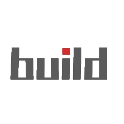

<h1 style="text-align:center">Env-Based Auto Builder</h1>

    

Automatically build and package your project based on environment variable files.

## Use

1. Press Ctrl + P to open the Command Palette (on Mac, it’s Cmd + P).
2. Select a command (automatically retrieved from the local package’s scripts), then press Enter.
